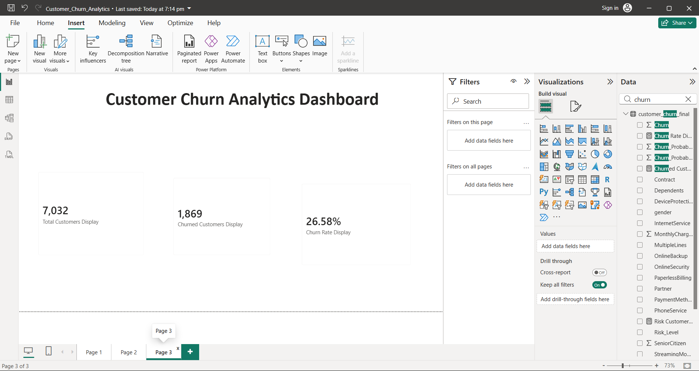

# Customer Churn Analytics

## 📌 Project Overview

## 📊 Dashboard Preview

This project analyzes customer churn patterns and identifies customers who are at higher risk of leaving a service.

The project uses Python for data analysis and machine learning, and Power BI for interactive visualization and dashboard creation.

## 🛠️ Technologies Used

- Python
- Pandas
- NumPy
- Matplotlib
- Scikit-learn
- Power BI
- CSV Dataset

## 📊 Dataset

The dataset contains **7,032 customers** and **19 original features** related to customer demographics, services, contracts, billing, and churn.

## 🔍 Key Analysis

- Customer churn rate analysis
- Churn by contract type
- Churn by internet service
- Churn by payment method
- Customer risk-level analysis
- Average churn probability analysis
- High-risk customer identification

## 📈 Model Performance

- Accuracy: **80.31%**
- ROC-AUC Score: **0.837**

## 📌 Key Results

- Total Customers: **7,032**
- Churned Customers: **1,869**
- Overall Churn Rate: **26.58%**
- High Risk Customers: **1,044**
- Medium Risk Customers: **1,622**
- Low Risk Customers: **4,366**

## 📊 Power BI Dashboard

The Power BI dashboard provides interactive visualizations for customer churn, risk distribution, contract analysis, internet service analysis, payment method analysis, and churn probability.

## 👩‍💻 Author

Dipali
